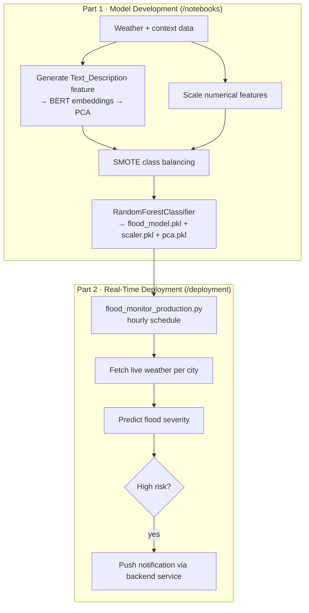

<div align="center">

# Hybrid AI Flood Prediction System

### Text + numeric hybrid model with a real-time monitoring deployment

[](https://python.org)
[](https://scikit-learn.org)
[](https://huggingface.co)

**A hybrid flood-risk model that fuses contextual text features (BERT + PCA) with scaled numerical weather data — plus a production script that polls live weather APIs and fires notifications on high risk.**

</div>

---

## Two Parts



## Part 1 — Model Development
- `1_Data_Exploration_and_Cleaning.ipynb` — analysis, the contextual `Text_Description` feature, BERT + PCA text processing, numeric scaling, SMOTE balancing
- `2_Model_Training_and_Evaluation.ipynb` — trains and evaluates the `RandomForestClassifier`
- Saves `flood_model.pkl`, `scaler.pkl`, `pca.pkl` to `/models`

## Part 2 — Real-Time Deployment
`deployment/flood_monitor_production.py` runs on a schedule, fetches live weather for a list of cities, predicts severity with the trained models, and sends a notification when high risk is detected.

> The deployment script is coupled to a project-specific weather/notification API and serves as a proof-of-concept for integrating the core model into a live system.

## Setup

```bash
git clone https://github.com/YazanAi-Dev3/flood-prediction-system.git
cd flood-prediction-system
pip install -r requirements.txt
jupyter lab      # explore /notebooks
```

## Tech Stack

`Python` · `scikit-learn` (RandomForest, SMOTE) · `BERT` + `PCA` (text features) · `Pandas`
